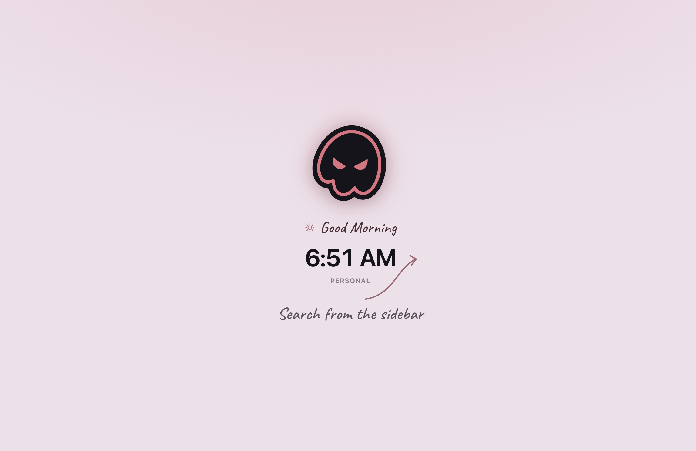
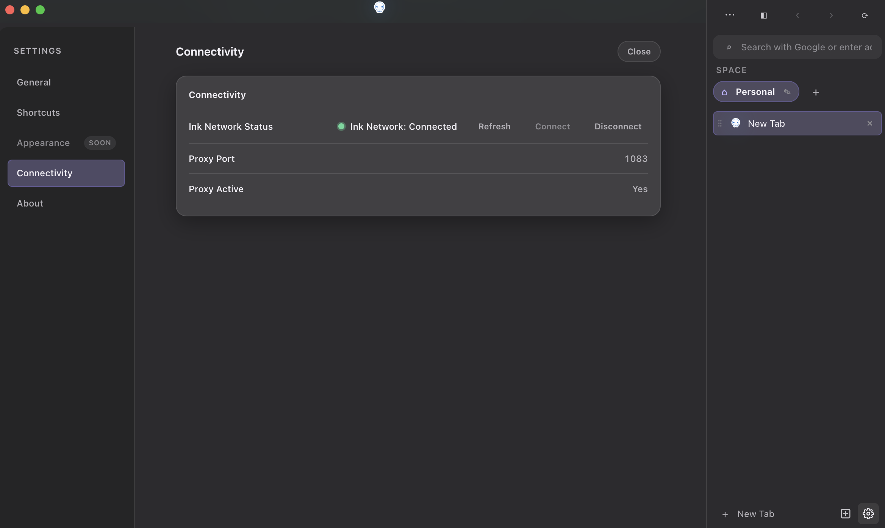

  
  
  

<h1 align="center" style="display: flex; justify-content: center; align-items: center; gap: 12px; margin-bottom: 10px;">
  
  CueInk
</h1>

  <i>The invisible browsing layer. Always on top, always ahead.</i>

---

> ### 📦 Download
> The latest stable public build is available via the [**Releases**](https://github.com/vix0x/CueInk-Builds/releases) tab.
> 
> ✅ Windows (Public Release)

text

> 🕰️ **macOS Support**: Actively maintained and fully functional internally. A public release is questionable; stay tuned.

---

> ### 🚀 Quick Start
> 
> **Windows**  
> Run `CueInk` as Administrator on the very first launch to initialize the Ink Network engine.

---

  <strong>Devloped & Maintained</strong> 
  by Carmen & Player

---

### 🌐 Join the Community

  

  <i>Want early access to CueInk builds, feature previews, or direct support?</i> 
  Join our Discord to connect with the community and the development team.

## 🖥️ Interface Preview

  <i>Start Page</i> 
  

  <i>Connectivity & Network Settings</i> 
  

